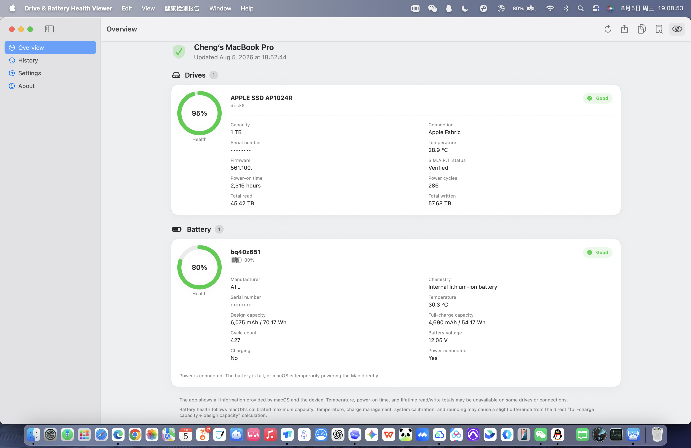
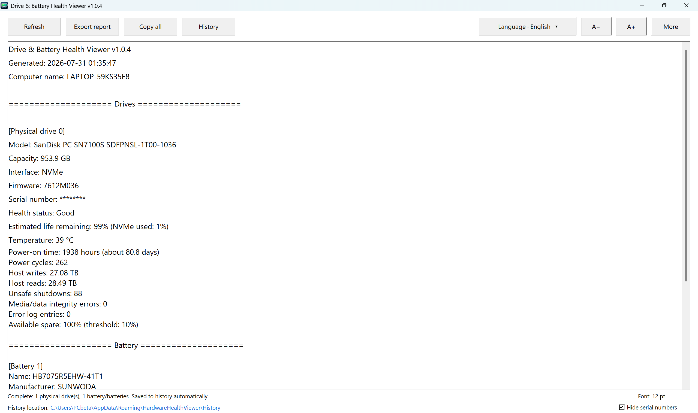
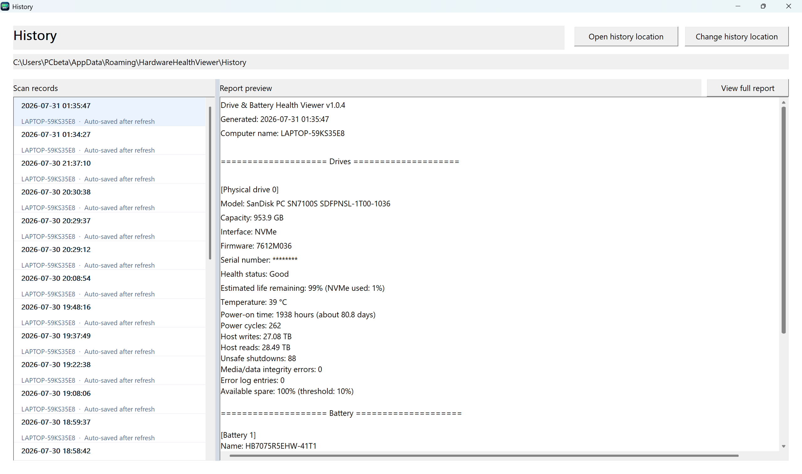

# 硬盘与电池健康查看器

**Drive & Battery Health Viewer**

简体中文 | [English](README_EN.md)

一款面向 Windows 与 macOS 的开源硬件健康查看工具。它以只读方式展示硬盘状态、电池健康度与设备信息，并支持历史记录、报告导出、序列号隐私保护和七种界面语言。

Windows 版使用 Go 开发；macOS 版采用原生 SwiftUI，提供同时兼容 Apple 芯片与 Intel Mac 的 Universal 2 应用。

## 下载

当前版本：**v1.0.4**。请前往 [Releases](../../releases/latest) 下载，或使用下方对应平台的文件。

| 平台 | 下载文件 | 架构 | 系统要求 |
| --- | --- | --- | --- |
| macOS | [`Drive-Battery-Health-Viewer-1.0.4-macOS-Universal.dmg`](../../releases/download/v1.0.4/Drive-Battery-Health-Viewer-1.0.4-macOS-Universal.dmg) | Apple Silicon + Intel | macOS 13 Ventura 或更高版本 |
| Windows | [`DriveBatteryHealthViewer_v1.0.4_Windows_x64.exe`](../../releases/download/v1.0.4/DriveBatteryHealthViewer_v1.0.4_Windows_x64.exe) | x64 | Windows 7 或更高版本 |

### macOS 安装

1. 打开下载的 DMG。
2. 将“硬盘与电池健康查看器”拖入“应用程序”文件夹。
3. 从“应用程序”中启动软件。

当前 macOS 公开构建采用 ad-hoc 签名，尚未经过 Apple 公证。如果首次启动被系统阻止，请在访达中右键应用并选择“打开”，或前往“系统设置 → 隐私与安全性”确认打开。项目不会要求关闭系统安全功能。

### Windows 使用

Windows x64 版本为单文件程序，无需安装，下载 EXE 后即可运行。部分硬件信息可能需要管理员权限。

## 界面预览

### macOS 原生界面



### Windows 主界面



### Windows 历史记录



## 主要功能

- 查看硬盘型号、容量、连接方式、固件、序列号和系统提供的 S.M.A.R.T. 状态
- 在硬件与系统允许时读取温度、通电时间、通电次数、总读取量和总写入量
- 查看电池制造商、类型、设计容量、满充容量、健康度、电压、循环次数、电量和充电状态
- 保存并浏览历史检测记录，复制或导出 UTF-8 健康报告
- 在界面、历史记录和导出报告中隐藏硬盘与电池序列号
- 支持简体中文、英语、俄语、法语、德语、韩语和日语
- 只读获取设备信息，不进行测速、写入、修复、擦除或固件更新

## 平台说明

### macOS

- 原生 SwiftUI 界面，支持深色模式、系统强调色、键盘操作与 VoiceOver 语义
- 电池电量、充电/供电状态以及可读取的硬盘与电池温度自动实时更新
- 刷新其他硬件数据时可自动保存历史报告
- 使用一个 Universal 2 安装包原生支持 Apple 芯片和 Intel Mac
- 详细功能、构建方式与数据限制见 [`macos/README.md`](macos/README.md)

macOS 不会向普通第三方应用开放所有 NVMe/USB S.M.A.R.T. 字段。无法读取的数据会明确显示为系统未报告，不会用 `0` 或推测值代替，也不会因此判断硬件故障。

### Windows

- RAID 模式或 Intel VMD/RST 可能影响完整 S.M.A.R.T. 信息读取
- USB 转接设备可能不会提供全部硬盘数据
- 部分旧版 Windows 或厂商驱动存在接口限制

这些情况通常属于系统、驱动、控制器或硬盘盒限制，并不代表硬件存在故障。

## 隐私说明

检测报告可能包含硬盘和电池序列号。公开发布、转发或上传报告前，建议启用软件中的“隐藏序列号”功能；macOS 版默认开启此保护。

## 从源码构建

### Windows

环境要求：Go 1.20 或更高版本。

```bash
go test ./...
go build -o DriveBatteryHealthViewer.exe .
```

### macOS

环境要求：macOS 13 或更高版本、Swift 5.10 或更高版本。

```bash
cd macos
swift test --disable-sandbox
./scripts/build-universal.sh
./scripts/build-dmg.sh
```

## 开源许可证

本项目依据 [GNU General Public License v3.0](LICENSE) 开源发布。你可以自由使用、研究、修改和分发本项目；发布修改版本时请遵守 GPL v3.0 并保留原有版权与许可证声明。

## 作者

**程心**

- GitHub：[@xincheng1237](https://github.com/xincheng1237)
- 酷安：程心ChengXin
- QQ 交流群：1040456137
- 联系邮箱：2680149724@qq.com

## 版权

© 2026 程心
