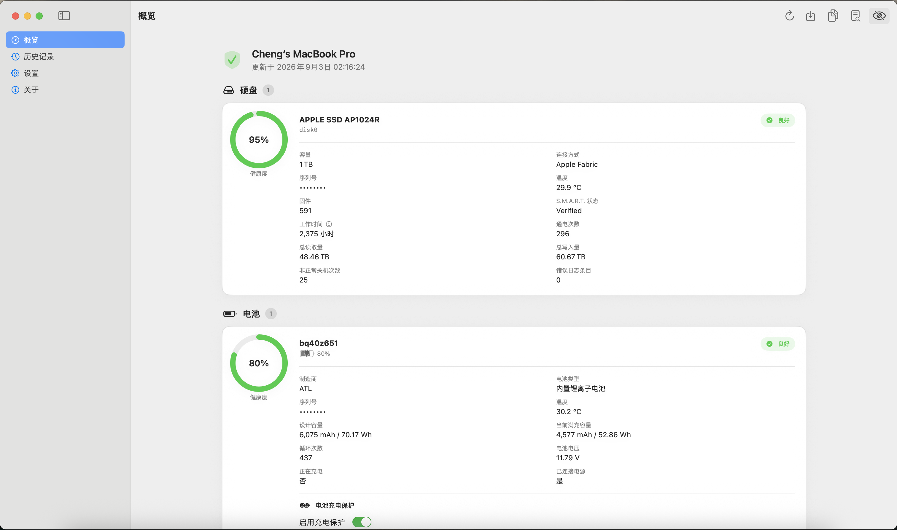
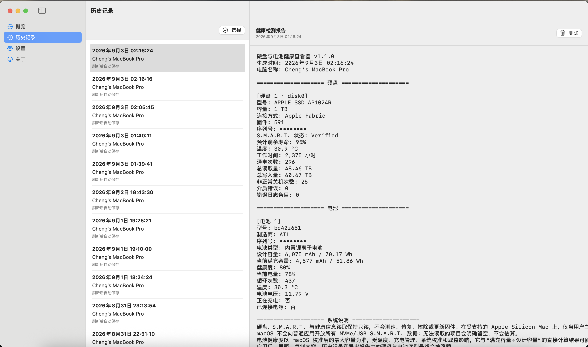
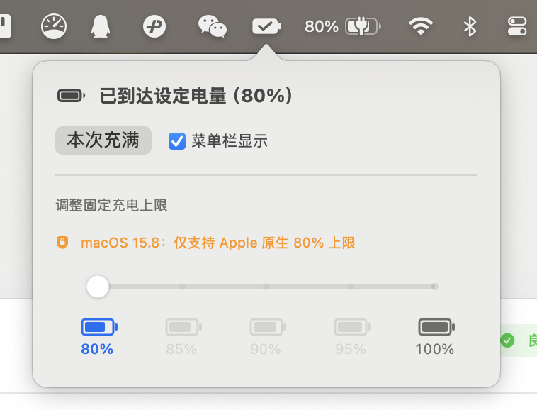
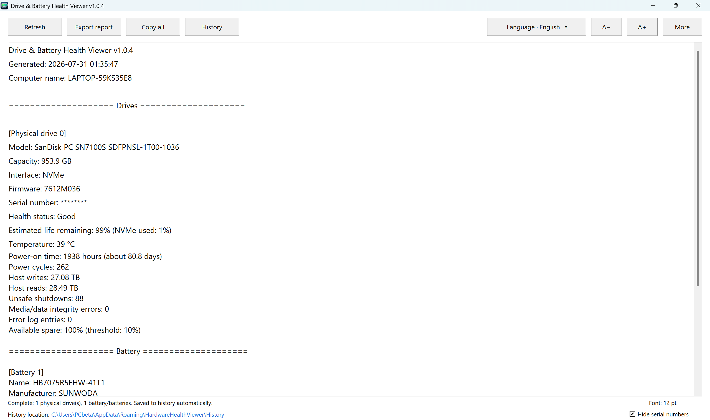
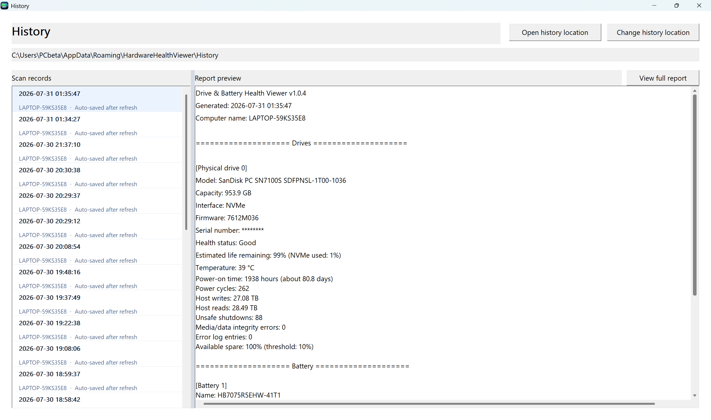

# Drive & Battery Health Viewer

**硬盘与电池健康查看器**

[简体中文](README.md) | English

An open-source hardware health viewer for Windows and macOS. It displays drive status, battery health, and device information, and includes history and batch management, report export, serial-number privacy protection, and seven interface languages.

The Windows edition is written in Go. The macOS edition uses native SwiftUI and ships as one Universal 2 application for both Apple silicon and Intel Macs.

## Download

Current macOS version: **v1.1.0**; Windows version: **v1.0.6**. Visit [Releases](../../releases/latest) to download the appropriate platform file.

| Platform | Download | Architecture | Requirements |
| --- | --- | --- | --- |
| macOS | [`DriveBatteryHealthViewer_v1.1.0_macOS_Universal.dmg`](../../releases/download/v1.1.0/DriveBatteryHealthViewer_v1.1.0_macOS_Universal.dmg) | Apple silicon + Intel | macOS 13 Ventura or later |
| Windows | [Installer](../../releases/download/v1.0.6/DriveBatteryHealthViewer_v1.0.6_Windows_x64_Setup.exe) | x64 | Windows 7 or later |

### Install on macOS

1. Open the downloaded DMG.
2. Drag **Drive & Battery Health Viewer** into **Applications**.
3. Launch the app from the Applications folder.

The current public macOS build uses an ad-hoc signature and has not been notarized by Apple. If macOS blocks the first launch, approve the app in **System Settings → Privacy & Security**.

### Install on Windows

The Windows x64 edition is distributed as a standard installer and does not require ZIP extraction. It launches the verified compatibility interface by default so the layout and high-DPI behavior stay consistent across supported Windows versions. The bundled WinUI interface can be evaluated explicitly with `DriveBatteryHealthViewer.exe --modern` on Windows 10 version 1809 or later. Administrator privileges may be needed for some hardware information; supported native storage interfaces are used where available and earlier versions automatically use compatibility readers.

### Release archive

Build artifacts are automatically copied to the immutable
[`release-archive`](release-archive/) directory, keyed by version, purpose, and SHA-256.
The user-confirmed build, GitHub releases, historical tests, and hash-only records are
organized in [`ARCHIVE_INDEX.md`](release-archive/ARCHIVE_INDEX.md) and
[`catalog.json`](release-archive/catalog.json). Run
[`verify-release-archive.ps1`](verify-release-archive.ps1) to verify every local artifact.

## Screenshots

### Native macOS interface







### Windows main window



### Windows history



## Features

- View drive model, capacity, connection, firmware, serial number, and system-provided S.M.A.R.T. status
- Read temperature, operating time, power cycles, total reads, and total writes when exposed by the hardware and operating system
- View battery manufacturer, chemistry, design capacity, full-charge capacity, health, voltage, and cycle count
- Save and browse health history with multi-select, Select All, batch export, and batch deletion
- Copy or export UTF-8 health reports
- Hide drive and battery serial numbers from the interface, history, and exported reports
- Support Simplified Chinese, English, Russian, French, German, Korean, and Japanese
- Keep drive, S.M.A.R.T., and health-data access read-only: no benchmarks, repairs, erases, or firmware updates
- macOS v1.1.0 adds optional charge protection with menu-bar status and quick controls on supported Apple silicon Macs, plus privacy-friendly diagnostic-log export by time range

## Platform notes

### macOS

- Native SwiftUI interface delivered as one Universal 2 package for Apple silicon and Intel Macs
- Supports macOS 13 and later, dark mode, system accent colors, keyboard operation, and VoiceOver
- Live battery level and charging status, plus drive and battery temperatures when reported by the system
- History, report export, serial-number hiding, and privacy-friendly diagnostic logs
- Bundled read-only `smartctl`; the app never benchmarks, repairs, erases, or updates drive firmware

#### Charge protection compatibility

| Device and system | Available behavior |
| --- | --- |
| Apple silicon + macOS 13 through 26.3 (except macOS 15.8) | 80% / 85% / 90% / 95% / 100% charge limits |
| Apple silicon + macOS 15.8 | Apple’s native 80% charge limit; selecting 100% turns charge protection off |
| Apple silicon + macOS 26.4 or later | The native macOS feature is recommended; users may explicitly choose software management instead |
| Intel Mac | Charging is managed by macOS; software charge protection is unavailable |

Charge protection is off by default and works only after the user enables it. When the app is updated, it checks the charge helper version and completely replaces an older helper when necessary.

The information available for an external drive depends on macOS, the connection, the enclosure, and whether the driver exposes low-level data. Fields not reported by the system remain empty; the app does not estimate or invent values.

Drive operating time is reported by drive firmware and is not the same as the computer’s power-on time or actual usage time. See [`macos/README.md`](macos/README.md) for more technical details.

### Windows

- RAID mode and Intel VMD/RST may prevent complete S.M.A.R.T. access
- USB adapters may not expose all drive information
- Older Windows versions and vendor drivers may have interface limitations

These conditions are normally caused by the operating system, driver, controller, or enclosure and do not necessarily indicate a hardware failure.

## Privacy

Health reports may contain drive and battery serial numbers. Enable **Hide serial numbers** before publishing, forwarding, or uploading a report. The macOS edition enables this protection by default.

## Building from Source

### Windows

Go 1.20.14 is required for the release build (the script checks the exact version).
For a compatibility-only build, use:

```bash
go test ./...
go build -o DriveBatteryHealthViewer.exe .
```

To produce the complete dual-interface installer, run `build-windows.ps1`. A successful
installer build is automatically copied into `release-archive` without replacing an
existing hash directory. See [`BUILDING_WINDOWS.md`](BUILDING_WINDOWS.md) for options.

### macOS

Requires macOS 13 or later and Swift 5.10 or later.

```bash
cd macos
swift test --disable-sandbox
./scripts/build-universal.sh
./scripts/build-dmg.sh
```

## License

This project is released under the [GNU General Public License v3.0](LICENSE). You may use, study, modify, and distribute it. Modified distributions must comply with GPL v3.0 and retain the original copyright and license notices.

The macOS charge-control core adapts and refactors the AppleSMC, CHTE/CHIE, and fail-safe concepts from TY-teo’s [ChargeWatch](https://github.com/TY-teo/ChargeWatching), with compatibility for the legacy CH0B/CH0C control pair. ChargeWatch is MIT-licensed; its copyright, license, and source notice are retained in [`macos/Resources/ThirdParty/ChargeWatch/`](macos/Resources/ThirdParty/ChargeWatch/).

## Author

**ChengXin**

- GitHub: [@xincheng1237](https://github.com/xincheng1237)
- Coolapk: 程心ChengXin
- QQ group: 1040456137
- Email: 2680149724@qq.com

## Copyright

© 2026 ChengXin
