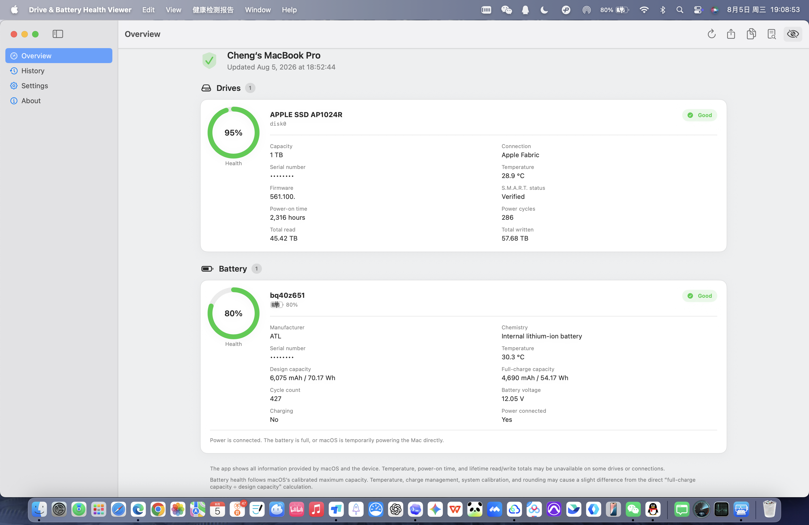

# Drive & Battery Health Viewer

**硬盘与电池健康查看器**

[简体中文](README.md) | English

An open-source hardware health viewer for Windows and macOS. It displays drive status, battery health, and device information, and includes history and batch management, report export, update checking, serial-number privacy protection, and seven interface languages.

The Windows edition is written in Go. The macOS edition uses native SwiftUI and ships as one Universal 2 application for both Apple silicon and Intel Macs.

## Download

Current macOS version: **v1.1.0**; Windows version: **v1.0.4**. Visit [Releases](../../releases/latest) to download the appropriate platform file.

| Platform | Download | Architecture | Requirements |
| --- | --- | --- | --- |
| macOS | [`DriveBatteryHealthViewer_v1.1.0_macOS_Universal.dmg`](../../releases/download/v1.1.0/DriveBatteryHealthViewer_v1.1.0_macOS_Universal.dmg) | Apple silicon + Intel | macOS 13 Ventura or later |
| Windows | [`DriveBatteryHealthViewer_v1.0.4_Windows_x64.exe`](../../releases/download/v1.0.4/DriveBatteryHealthViewer_v1.0.4_Windows_x64.exe) | x64 | Windows 7 or later |

### Install on macOS

1. Open the downloaded DMG.
2. Drag **Drive & Battery Health Viewer** into **Applications**.
3. Launch the app from the Applications folder.

The current public macOS build uses an ad-hoc signature and has not been notarized by Apple. If macOS blocks the first launch, Control-click the app and choose **Open**, or approve it in **System Settings → Privacy & Security**. The project never asks you to disable system security features.

### Run on Windows

The Windows x64 edition is a standalone executable. No installation is required. Administrator privileges may be needed for some hardware information.

## Screenshots

### Native macOS interface



### Windows main window


### Windows history


## Features

- View drive model, capacity, connection, firmware, serial number, and system-provided S.M.A.R.T. status
- Read temperature, operating time, power cycles, total reads, and total writes when exposed by the hardware and operating system
- View battery manufacturer, chemistry, design capacity, full-charge capacity, health, voltage, cycle count, charge level, and power state
- Save and browse health history with multi-select, Select All, batch export, and batch deletion
- Copy or export UTF-8 reports and check GitHub for the latest stable release from the application menu
- Hide drive and battery serial numbers from the interface, history, and exported reports
- Support Simplified Chinese, English, Russian, French, German, Korean, and Japanese
- Keep drive, S.M.A.R.T., and health-data access read-only: no benchmarks, repairs, erases, or firmware updates
- macOS v1.1.0 adds optional charge protection with menu-bar status and quick controls on supported Apple silicon Macs, plus privacy-friendly diagnostic-log export by time range

## Platform notes

### macOS

- Native SwiftUI interface with dark mode, system accent colors, keyboard support, and VoiceOver semantics
- Liquid Glass interface treatment on macOS 26 and later
- Live updates for battery level, charge/power state, and available drive and battery temperatures
- Optional automatic history saving when other hardware data is manually refreshed
- One Universal 2 package runs natively on Apple silicon and Intel Macs
- Bundled Universal 2 read-only `smartctl` can add drive details when macOS or an installed compatible driver exposes the low-level data
- See [`macos/README.md`](macos/README.md) for implementation details, build steps, and hardware-data limitations

On Apple silicon Macs, macOS 13 through 26.3 (except macOS 15.8) offers 80% / 85% / 90% / 95% / 100% after runtime capability detection succeeds. macOS 15.8 uses the native PowerUI OBC path: 80% enables the native limit, 100% turns charge protection off, and 85% / 90% / 95% remain visible but disabled. macOS 26.4 or later recommends the built-in system feature by default; users may explicitly choose software management and, after confirming the required system settings, use the same multi-level interface. Software control prefers adapter-preserving CHTE, then legacy CH0B+CH0C on older Apple silicon firmware. Adapter-isolating CHIE is never used as the normal fallback. Intel Macs do not expose this feature. The main app never runs as root, and a new app version verifies and completely replaces a mismatched installed helper on first launch.

Diagnostic logs omit drive and battery serial numbers, report contents, usernames, and complete private paths by default. App logs are stored in `~/Library/Logs/DriveBatteryHealthViewer/`; helper logs are stored in `/Library/Logs/DriveBatteryHealthViewer/`. Logs are rotated at roughly 14 days and 20 MB.

macOS does not natively provide generic USB/SCSI S.M.A.R.T. passthrough. The bundled reader installs no driver and does not probe bridge modes unsupported by the system; it adds details only when macOS, a Thunderbolt connection, or an installed compatible driver exposes the low-level device. Data may still be unavailable when an enclosure blocks passthrough, RAID exposes only a logical device, or macOS denies the interface. Unavailable values are shown as not reported.

Drive operating time is reported by the drive firmware and may exclude periods when the controller is in a low-power state. It is not the same as the computer's power-on or actual usage time.

### Windows

- RAID mode and Intel VMD/RST may prevent complete S.M.A.R.T. access
- USB adapters may not expose all drive information
- Older Windows versions and vendor drivers may have interface limitations

These conditions are normally caused by the operating system, driver, controller, or enclosure and do not necessarily indicate a hardware failure.

## Privacy

Health reports may contain drive and battery serial numbers. Enable **Hide serial numbers** before publishing, forwarding, or uploading a report. The macOS edition enables this protection by default.

## Building from Source

### Windows

Requires Go 1.20 or later.

```bash
go test ./...
go build -o DriveBatteryHealthViewer.exe .
```

### macOS

Requires macOS 13 or later and Swift 5.10 or later.

```bash
cd macos
swift test --disable-sandbox
./scripts/build-universal.sh
./scripts/build-dmg.sh
```

## License

This project is released under the [GNU General Public License v3.0](LICENSE). You may use, study, modify, and distribute it. Modified distributions must comply with GPL v3.0 and retain the original copyright and license notices.

The macOS charge-control core adapts and refactors the AppleSMC, CHTE/CHIE, and fail-safe concepts from TY-teo’s [ChargeWatch](https://github.com/TY-teo/ChargeWatching), with compatibility for the legacy CH0B/CH0C control pair. ChargeWatch is MIT-licensed; its copyright, license, and source notice are retained in [`macos/Resources/ThirdParty/ChargeWatch/`](macos/Resources/ThirdParty/ChargeWatch/).

## Author

**ChengXin**

- GitHub: [@xincheng1237](https://github.com/xincheng1237)
- Coolapk: [程心ChengXin](https://www.coolapk.com/u/3594167)
- QQ group: 1040456137
- Email: 2680149724@qq.com

## Copyright

© 2026 ChengXin
